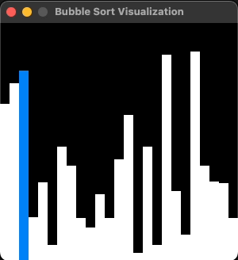
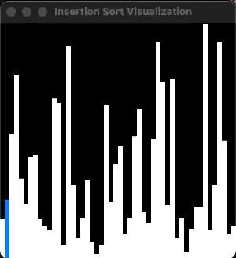
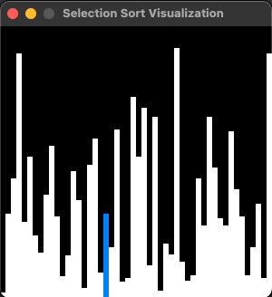

# ds_alg

My implementations of data structures and algorithms in C++.

## Build and run

:warning: Installation of some X11 libraries may be required to build it.

Build:

```console
cmake -S ds_alg -B build && cmake --build build 
```

Run tests:

```console
ctest --test-dir build/test --output-on-failure
```

Run visualizations:

UNIX:

```console
./build/executables/[algorithm]_visualizer
```

Windows:

```console
.\build\executables\Debug\[algorithm]_visualizer.exe
```

## Implemented visualizations

### Bubble sort

- [algorithm](ds_alg/include/alg/bubble_sort.h)
- [visualizer](ds_alg/executables/bubble_sort_visualizer.cc)



## Insertion sort

- [algorithm](ds_alg/include/alg/insertion_sort.h)
- [visualizer](ds_alg/executables/insertion_sort_visualizer.cc)



## Selection sort

- [algorithm](ds_alg/include/alg/selection_sort.h)
- [visualizer](ds_alg/executables/selection_sort_visualizer.cc)


