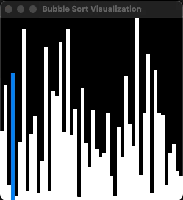

# ds_alg

My implementations of data structures and algorithms in C++.

## Build and run

:warning: Might not run on Windows.

:warning: Installation of some X11 libraries may be required to build it.

Build:

```console
cmake -S . -B build && cmake --build build 
```

Run tests:

```console
GTEST_COLOR=1 ctest --test-dir build/ds_alg/test --output-on-failure 
```

Run visualizations:

```console
./build/ds_alg/executables/[algorithm]_visualizer
```

## Implemented visualizations

### Bubble sort

- [algorithm](ds_alg/include/alg/bubble_sort.h)
- [visualization](ds_alg/executables/bubble_sort_visualizer.cc)


